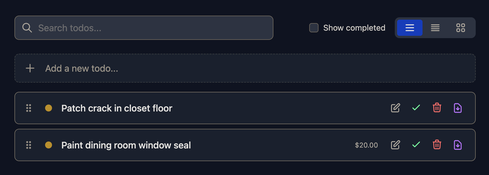

# TODO APP

This simple todo application was created with the help of Copilot using Claude Opus 4.5

## Screenshot



## Developing

Once you've installed dependencies with `npm install` (or `pnpm install` or `yarn`), start a development server:

```sh
npm run dev

# or start the server and open the app in a new browser tab
npm run dev -- --open
```

## Building

To create a production version of your app:

```sh
npm run build
```

You can preview the production build with `npm run preview`.

## Running in Docker

### First-time Setup

1. Build and start the container:

   ```sh
   docker compose up -d --build
   ```

2. The application will be available at http://localhost:3000

3. The SQLite database is persisted in the `./data` directory on your host machine.

### Updating After Code Changes

When you make changes to the application code:

```sh
# Rebuild and restart the container
docker compose up -d --build
```

This will:

- Rebuild the Docker image with your changes
- Restart the container with the new image
- Preserve your existing database data

### Other Useful Commands

```sh
# View logs
docker compose logs -f

# Stop the container
docker compose down

# Stop and remove volumes (WARNING: deletes database)
docker compose down -v

# Restart without rebuilding
docker compose restart
```

## From Scratch

To recreate this project, start with [`sv`](https://github.com/sveltejs/cli)

```sh
# recreate this project
npx sv create --template minimal --types ts --add prettier tailwindcss="plugins:typography,forms" drizzle="database:sqlite+sqlite:better-sqlite3" mcp="ide:vscode+setup:remote" --install npm todo-app
```

and then point your agent to the instructions below.

## Agent Instructions

Build a todo application using SvelteKit 5 with Svelte 5 runes, Drizzle ORM, SQLite, and TailwindCSS. The code should be maintainable by a human with limited Node.js experience - add comments where things are not perfectly clear.

### Database Schema

Create a `todo` table in SQLite with the following fields:

- `id` - text primary key (UUID generated via crypto.randomUUID())
- `title` - text, required
- `description` - text, optional
- `notes` - text, optional
- `contractor_hired` - integer (0/1 boolean), required, default 0
- `contractor_name` - text, optional
- `contractor_details` - text, optional
- `cost` - integer, optional (stored as cents to avoid floating point issues)
- `completed` - integer (0/1 boolean), required, default 0
- `sort_order` - integer, required, default 0 (for drag-drop ordering)
- `created_at` - integer timestamp, required
- `updated_at` - integer timestamp, required

### Server Actions

Implement the following form actions in `+page.server.ts`:

- `create` - add new todo with next sort order
- `update` - edit existing todo fields
- `complete` - mark todo as completed
- `restore` - mark completed todo as not completed
- `delete` - remove todo from database
- `reorder` - update sort_order values after drag-drop (accepts JSON array of {id, sortOrder})

### UI Features

1. **Three view modes** (toggle via buttons):
   - Grid view: cards in responsive grid layout
   - List view: compact rows with inline actions
   - Detail view: expanded list item showing all fields

2. **Add/Edit modal**:
   - Title field (required)
   - Description textarea
   - Notes textarea
   - "Contractor Hired" checkbox - when checked, reveal:
     - Contractor Name input
     - Contractor Details textarea
   - Cost field (dollar input, converted to cents for storage)

3. **Search filter**: Client-side filter that searches title and description (case-insensitive)

4. **Completed toggle**: Checkbox to show/hide completed items (default: hidden)

5. **Drag and drop**: Reorder uncompleted todos by dragging (use native HTML5 drag/drop API)

6. **Animations**: Fade out items when completing or deleting (CSS transition with setTimeout)

7. **PDF export**: Export individual todo to PDF using pdfmake (dynamic import to avoid SSR issues)
   - Include all todo fields in formatted document
   - Download as "{title}.pdf"

### Styling

- Use TailwindCSS 4 with @tailwindcss/forms and @tailwindcss/typography plugins
- Dark mode only (dark gray backgrounds: bg-gray-900, bg-gray-800, bg-gray-700)
- Responsive design for mobile and desktop
- Visual indicators for completed items (opacity, strikethrough)

### Docker Deployment

1. Change `svelte.config.js` to use `@sveltejs/adapter-node` instead of adapter-auto
2. Create `Dockerfile`:
   - Multi-stage build (build stage + production stage)
   - Use Node.js 20 alpine images
   - Copy built output and node_modules to production image
   - Expose port 3000
3. Create `docker-compose.yml`:
   - Mount volume for SQLite database persistence (`./data:/app/data`)
   - Set `DATABASE_URL` environment variable
   - Map port 3000
4. Create `.dockerignore` to exclude node_modules, .svelte-kit, etc.

### Key Implementation Details

- Use Svelte 5 runes: `$state()`, `$derived()`, `$props()`
- Use `{@render children()}` instead of `<slot/>`
- Form submissions use SvelteKit's `enhance` for progressive enhancement
- Currency helper functions: `formatCurrency(cents)` and `centsToDollars(cents)`
- Sort todos by: completed (false first), then sortOrder ascending
